Seahawks Offense Analysis
================
Braden Baker
5/4/2019

The Seahawks passing game in the 2018 NFL season appeared to be very
effective based on TV broadcasts. This project looks at how the Seahawks
passed, what passing was effective, and how the wide recievers
performed.This is a very large NFL dataset that is already mostly
cleaned. It contains variables of offensive, defensive, and specical
teams plays. The data is mostly made up of integers and character data
types.

``` r
library(tidyverse)
```

    ## -- Attaching packages ------------------------------------------------------------------------------------------------------------------------ tidyverse 1.3.0 --

    ## <U+2713> ggplot2 3.2.1     <U+2713> purrr   0.3.3
    ## <U+2713> tibble  2.1.3     <U+2713> dplyr   0.8.3
    ## <U+2713> tidyr   1.0.0     <U+2713> stringr 1.4.0
    ## <U+2713> readr   1.3.1     <U+2713> forcats 0.4.0

    ## -- Conflicts --------------------------------------------------------------------------------------------------------------------------- tidyverse_conflicts() --
    ## x dplyr::filter() masks stats::filter()
    ## x dplyr::lag()    masks stats::lag()

``` r
library(openintro)
```

    ## Please visit openintro.org for free statistics materials

    ## 
    ## Attaching package: 'openintro'

    ## The following object is masked from 'package:ggplot2':
    ## 
    ##     diamonds

    ## The following objects are masked from 'package:datasets':
    ## 
    ##     cars, trees

``` r
load(file="sea1.Rdata")


str(sea1)
```

    ## Classes 'tbl_df', 'tbl' and 'data.frame':    2789 obs. of  256 variables:
    ##  $ play_id                             : chr  "36" "51" "73" "105" ...
    ##  $ game_id                             : chr  "2018090911" "2018090911" "2018090911" "2018090911" ...
    ##  $ home_team                           : chr  "DEN" "DEN" "DEN" "DEN" ...
    ##  $ away_team                           : chr  "SEA" "SEA" "SEA" "SEA" ...
    ##  $ posteam                             : chr  "DEN" "DEN" "DEN" "DEN" ...
    ##  $ posteam_type                        : chr  "home" "home" "home" "home" ...
    ##  $ defteam                             : chr  "SEA" "SEA" "SEA" "SEA" ...
    ##  $ side_of_field                       : chr  "SEA" "DEN" "DEN" "DEN" ...
    ##  $ yardline_100                        : num  35 75 75 79 79 65 65 61 61 84 ...
    ##  $ game_date                           : Date, format: "2018-09-09" "2018-09-09" ...
    ##  $ quarter_seconds_remaining           : num  900 900 897 865 857 831 790 748 743 731 ...
    ##  $ half_seconds_remaining              : num  1800 1800 1797 1765 1757 ...
    ##  $ game_seconds_remaining              : num  3600 3600 3597 3565 3557 ...
    ##  $ game_half                           : chr  "Half1" "Half1" "Half1" "Half1" ...
    ##  $ quarter_end                         : num  0 0 0 0 0 0 0 0 0 0 ...
    ##  $ drive                               : int  1 1 1 1 1 1 1 1 1 2 ...
    ##  $ sp                                  : num  0 0 0 0 0 0 0 0 0 0 ...
    ##  $ qtr                                 : num  1 1 1 1 1 1 1 1 1 1 ...
    ##  $ down                                : Factor w/ 4 levels "1","2","3","4": NA 1 2 2 3 1 2 3 4 1 ...
    ##  $ goal_to_go                          : num  0 0 0 0 0 0 0 0 0 0 ...
    ##  $ time                                : chr  "15:00" "15:00" "14:57" "14:25" ...
    ##  $ yrdln                               : chr  "SEA 35" "DEN 25" "DEN 25" "DEN 21" ...
    ##  $ ydstogo                             : num  0 10 10 14 14 10 10 6 6 10 ...
    ##  $ ydsnet                              : num  14 14 14 14 14 14 14 14 14 4 ...
    ##  $ desc                                : chr  "S.Janikowski kicks 65 yards from SEA 35 to end zone, Touchback." "(15:00) (Shotgun) C.Keenum pass incomplete short left to De.Thomas." "(14:57) R.Freeman left end pushed ob at DEN 37 for 12 yards (T.Flowers). PENALTY on DEN-De.Thomas, Offensive Ho"| __truncated__ "(14:25) (Shotgun) C.Keenum pass incomplete short middle to De.Thomas (E.Thomas) [J.Reed]." ...
    ##  $ play_type                           : chr  "kickoff" "pass" "run" "pass" ...
    ##  $ yards_gained                        : num  0 0 6 0 14 0 4 0 0 -6 ...
    ##  $ shotgun                             : num  0 1 0 1 1 0 0 1 0 0 ...
    ##  $ no_huddle                           : num  0 0 0 0 0 0 0 0 0 0 ...
    ##  $ qb_dropback                         : num  0 1 0 1 1 0 0 1 0 1 ...
    ##  $ qb_kneel                            : num  0 0 0 0 0 0 0 0 0 0 ...
    ##  $ qb_spike                            : num  0 0 0 0 0 0 0 0 0 0 ...
    ##  $ qb_scramble                         : num  0 0 0 0 0 0 0 0 0 0 ...
    ##  $ pass_length                         : chr  NA "short" NA "short" ...
    ##  $ pass_location                       : chr  NA "left" NA "middle" ...
    ##  $ air_yards                           : num  NA 9 NA 9 14 NA NA 16 NA NA ...
    ##  $ yards_after_catch                   : num  NA NA NA NA 0 NA NA NA NA NA ...
    ##  $ run_location                        : chr  NA NA "left" NA ...
    ##  $ run_gap                             : chr  NA NA "end" NA ...
    ##  $ field_goal_result                   : chr  NA NA NA NA ...
    ##  $ kick_distance                       : num  NA NA NA NA NA NA NA NA 45 NA ...
    ##  $ extra_point_result                  : chr  NA NA NA NA ...
    ##  $ two_point_conv_result               : chr  NA NA NA NA ...
    ##  $ home_timeouts_remaining             : num  3 3 3 3 3 3 3 3 3 3 ...
    ##  $ away_timeouts_remaining             : num  3 3 3 3 3 3 3 3 3 3 ...
    ##  $ timeout                             : num  0 0 0 0 0 0 0 0 0 0 ...
    ##  $ timeout_team                        : chr  NA NA NA NA ...
    ##  $ td_team                             : chr  NA NA NA NA ...
    ##  $ posteam_timeouts_remaining          : num  3 3 3 3 3 3 3 3 3 3 ...
    ##  $ defteam_timeouts_remaining          : num  3 3 3 3 3 3 3 3 3 3 ...
    ##  $ total_home_score                    : num  0 0 0 0 0 0 0 0 0 0 ...
    ##  $ total_away_score                    : num  0 0 0 0 0 0 0 0 0 0 ...
    ##  $ posteam_score                       : num  NA 0 0 0 0 0 0 0 0 0 ...
    ##  $ defteam_score                       : num  NA 0 0 0 0 0 0 0 0 0 ...
    ##  $ score_differential                  : num  NA 0 0 0 0 0 0 0 0 0 ...
    ##  $ posteam_score_post                  : num  0 0 0 0 0 0 0 0 0 0 ...
    ##  $ defteam_score_post                  : num  0 0 0 0 0 0 0 0 0 0 ...
    ##  $ score_differential_post             : num  0 0 0 0 0 0 0 0 0 0 ...
    ##  $ no_score_prob                       : num  0.00137 0.00137 0.00142 0.00171 0.00169 ...
    ##  $ opp_fg_prob                         : num  0.163 0.163 0.189 0.207 0.246 ...
    ##  $ opp_safety_prob                     : num  0.00444 0.00444 0.0057 0.00802 0.0086 ...
    ##  $ opp_td_prob                         : num  0.254 0.254 0.296 0.326 0.381 ...
    ##  $ fg_prob                             : num  0.233 0.233 0.213 0.195 0.151 ...
    ##  $ safety_prob                         : num  0.00366 0.00366 0.00399 0.00391 0.00459 ...
    ##  $ td_prob                             : num  0.341 0.341 0.292 0.258 0.207 ...
    ##  $ extra_point_prob                    : num  0 0 0 0 0 0 0 0 0 0 ...
    ##  $ two_point_conversion_prob           : num  0 0 0 0 0 0 0 0 0 0 ...
    ##  $ ep                                  : num  0.815 0.815 0.0433 -0.5174 -1.5147 ...
    ##  $ epa                                 : num  0 -0.772 -0.561 -0.997 3.28 ...
    ##  $ total_home_epa                      : num  0 -0.772 -1.332 -2.33 0.95 ...
    ##  $ total_away_epa                      : num  0 0.772 1.332 2.33 -0.95 ...
    ##  $ total_home_rush_epa                 : num  0 0 -0.561 -0.561 -0.561 ...
    ##  $ total_away_rush_epa                 : num  0 0 0.561 0.561 0.561 ...
    ##  $ total_home_pass_epa                 : num  0 -0.772 -0.772 -1.769 1.511 ...
    ##  $ total_away_pass_epa                 : num  0 0.772 0.772 1.769 -1.511 ...
    ##  $ air_epa                             : num  NA 0.115 NA -0.152 3.28 ...
    ##  $ yac_epa                             : num  NA -0.886 NA -0.845 0 ...
    ##  $ comp_air_epa                        : num  0 0 0 0 3.28 ...
    ##  $ comp_yac_epa                        : num  0 0 0 0 0 0 0 0 0 0 ...
    ##  $ total_home_comp_air_epa             : num  0 0 0 0 3.28 ...
    ##  $ total_away_comp_air_epa             : num  0 0 0 0 -3.28 ...
    ##  $ total_home_comp_yac_epa             : num  0 0 0 0 0 0 0 0 0 0 ...
    ##  $ total_away_comp_yac_epa             : num  0 0 0 0 0 0 0 0 0 0 ...
    ##  $ total_home_raw_air_epa              : num  0 0.1145 0.1145 -0.0379 3.2421 ...
    ##  $ total_away_raw_air_epa              : num  0 -0.1145 -0.1145 0.0379 -3.2421 ...
    ##  $ total_home_raw_yac_epa              : num  0 -0.886 -0.886 -1.731 -1.731 ...
    ##  $ total_away_raw_yac_epa              : num  0 0.886 0.886 1.731 1.731 ...
    ##  $ wp                                  : num  NA 0.5 0.478 0.463 0.434 ...
    ##  $ def_wp                              : num  NA 0.5 0.522 0.537 0.566 ...
    ##  $ home_wp                             : num  NA 0.5 0.478 0.463 0.434 ...
    ##  $ away_wp                             : num  NA 0.5 0.522 0.537 0.566 ...
    ##  $ wpa                                 : num  NA -0.0223 -0.0144 -0.029 0.0981 ...
    ##  $ home_wp_post                        : num  NA 0.478 0.463 0.434 0.532 ...
    ##  $ away_wp_post                        : num  NA 0.522 0.537 0.566 0.468 ...
    ##  $ total_home_rush_wpa                 : num  0 0 -0.0144 -0.0144 -0.0144 ...
    ##  $ total_away_rush_wpa                 : num  0 0 0.0144 0.0144 0.0144 ...
    ##  $ total_home_pass_wpa                 : num  0 -0.0223 -0.0223 -0.0513 0.0468 ...
    ##  $ total_away_pass_wpa                 : num  0 0.0223 0.0223 0.0513 -0.0468 ...
    ##  $ air_wpa                             : num  NA 0.0037 NA -0.00412 0.09812 ...
    ##   [list output truncated]

## Cleaning and Preparation

This dataset contains many variables, and we are only intereasted in
ones relating to passing. Using dplyr tools the data is trimmed down
from 256 variables to 118 variables.

This dataset contains data for every play the seahawks had on offense,
defense, and special teams, to select only the data related to Russell
Wilson, the dataset is filtered to select data where the passer player
name column is equal to R. Wilson. Along with removing plays that
happened when the win probability was very low or high that happened in,
“garbage time.” This is done to make the data a better representation of
the true passing game throughout the season.

This data is already fairly clean but, the quarter value is stored as an
integer but is really a factor. I also cut the air yard column and the
yard line column into groups to be used later.

I will mainly be using expected points per attempt to judge
effectiveness, which is stored as “epa” in this dataset.

``` r
wilson <- sea1 %>% 
  filter(passer_player_name == "R.Wilson" & wp > 0.1 & wp < 0.9) %>%
  select(-(punt_returner_player_id:defensive_extra_point_conv), -contains('td_team'), -contains('timeout'), -contains('interception_player'), -contains('fumble'),-contains('result'), -contains('run'), -contains('rush'), -contains('punt'), -contains('tackle'), -contains('kick'), -contains('rusher'), -contains('lateral'))

wilson$qtr <- as.factor(wilson$qtr)
wilson$airyardgroup <- cut(x = wilson$air_yards, breaks = c(-15,-5,0,10,20,30,40,60))
wilson$yardlinegroup <- cut(x = wilson$yardline_100, breaks = c(100,80,60,40,20,0))

str(wilson)
```

    ## Classes 'tbl_df', 'tbl' and 'data.frame':    392 obs. of  120 variables:
    ##  $ play_id                  : chr  "244" "263" "413" "728" ...
    ##  $ game_id                  : chr  "2018090911" "2018090911" "2018090911" "2018090911" ...
    ##  $ home_team                : chr  "DEN" "DEN" "DEN" "DEN" ...
    ##  $ away_team                : chr  "SEA" "SEA" "SEA" "SEA" ...
    ##  $ posteam                  : chr  "SEA" "SEA" "SEA" "SEA" ...
    ##  $ posteam_type             : chr  "away" "away" "away" "away" ...
    ##  $ defteam                  : chr  "DEN" "DEN" "DEN" "DEN" ...
    ##  $ side_of_field            : chr  "SEA" "SEA" "DEN" "SEA" ...
    ##  $ yardline_100             : num  84 90 15 61 71 7 17 90 84 74 ...
    ##  $ game_date                : Date, format: "2018-09-09" "2018-09-09" ...
    ##  $ quarter_seconds_remaining: num  731 687 550 286 13 860 848 577 538 494 ...
    ##  $ half_seconds_remaining   : num  1631 1587 1450 1186 913 ...
    ##  $ game_seconds_remaining   : num  3431 3387 3250 2986 2713 ...
    ##  $ game_half                : chr  "Half1" "Half1" "Half1" "Half1" ...
    ##  $ quarter_end              : num  0 0 0 0 0 0 0 0 0 0 ...
    ##  $ drive                    : int  2 2 4 6 8 8 8 10 10 10 ...
    ##  $ sp                       : num  0 0 1 0 0 0 0 0 0 0 ...
    ##  $ qtr                      : Factor w/ 5 levels "1","2","3","4",..: 1 1 1 1 1 2 2 2 2 2 ...
    ##  $ down                     : Factor w/ 4 levels "1","2","3","4": 1 2 1 3 1 2 3 1 2 3 ...
    ##  $ goal_to_go               : num  0 0 0 0 0 1 1 0 0 0 ...
    ##  $ time                     : chr  "12:11" "11:27" "09:10" "04:46" ...
    ##  $ yrdln                    : chr  "SEA 16" "SEA 10" "DEN 15" "SEA 39" ...
    ##  $ ydstogo                  : num  10 16 10 3 10 7 17 25 19 9 ...
    ##  $ ydsnet                   : num  4 4 15 7 78 78 78 1 1 1 ...
    ##  $ desc                     : chr  "(12:11) R.Wilson sacked at SEA 10 for -6 yards (sack split by D.Stewart and B.Chubb)." "(11:27) (Shotgun) R.Wilson pass incomplete deep right to W.Dissly." "(9:10) R.Wilson pass short left to W.Dissly for 15 yards, TOUCHDOWN." "(4:46) (Shotgun) R.Wilson pass incomplete short left to T.Lockett (A.Gotsis)." ...
    ##  $ play_type                : chr  "pass" "pass" "pass" "pass" ...
    ##  $ yards_gained             : num  -6 0 15 0 66 0 0 6 10 0 ...
    ##  $ shotgun                  : num  0 1 0 1 0 1 1 1 1 1 ...
    ##  $ no_huddle                : num  0 0 0 0 0 0 0 0 0 0 ...
    ##  $ qb_dropback              : num  1 1 1 1 1 1 1 1 1 1 ...
    ##  $ qb_kneel                 : num  0 0 0 0 0 0 0 0 0 0 ...
    ##  $ qb_spike                 : num  0 0 0 0 0 0 0 0 0 0 ...
    ##  $ qb_scramble              : num  0 0 0 0 0 0 0 0 0 0 ...
    ##  $ pass_length              : chr  NA "deep" "short" "short" ...
    ##  $ pass_location            : chr  NA "right" "left" "left" ...
    ##  $ air_yards                : num  NA 20 10 3 15 7 4 5 1 14 ...
    ##  $ yards_after_catch        : num  NA NA 5 NA 51 NA NA 1 9 NA ...
    ##  $ total_home_score         : num  0 0 0 7 7 7 7 14 14 14 ...
    ##  $ total_away_score         : num  0 0 6 7 7 7 7 10 10 10 ...
    ##  $ posteam_score            : num  0 0 0 7 7 7 7 10 10 10 ...
    ##  $ defteam_score            : num  0 0 0 7 7 7 7 14 14 14 ...
    ##  $ score_differential       : num  0 0 0 0 0 0 0 -4 -4 -4 ...
    ##  $ posteam_score_post       : num  0 0 6 7 7 7 7 10 10 10 ...
    ##  $ defteam_score_post       : num  0 0 0 7 7 7 7 14 14 14 ...
    ##  $ score_differential_post  : num  0 0 6 0 0 0 0 -4 -4 -4 ...
    ##  $ no_score_prob            : num  0.00318 0.00399 0.00107 0.01294 0.04296 ...
    ##  $ opp_fg_prob              : num  0.1922 0.2444 0.0279 0.1477 0.1378 ...
    ##  $ opp_safety_prob          : num  9.02e-03 1.64e-02 2.02e-05 2.34e-03 2.92e-03 ...
    ##  $ opp_td_prob              : num  0.2989 0.3825 0.0427 0.2223 0.2081 ...
    ##  $ fg_prob                  : num  0.199 0.147 0.386 0.242 0.243 ...
    ##  $ safety_prob              : num  0.00349 0.00356 0.00257 0.00378 0.00339 ...
    ##  $ td_prob                  : num  0.294 0.202 0.54 0.369 0.362 ...
    ##  $ extra_point_prob         : num  0 0 0 0 0 0 0 0 0 0 ...
    ##  $ two_point_conversion_prob: num  0 0 0 0 0 0 0 0 0 0 ...
    ##  $ ep                       : num  -0.0225 -1.5811 4.5599 1.3115 1.3947 ...
    ##  $ epa                      : num  -1.559 -0.873 2.44 -2.014 4.309 ...
    ##  $ total_home_epa           : num  0.7661 1.6393 -7.815 -0.0665 -6.4727 ...
    ##  $ total_away_epa           : num  -0.7661 -1.6393 7.815 0.0665 6.4727 ...
    ##  $ total_home_pass_epa      : num  1.24722 2.12042 -4.33208 3.99559 -0.00273 ...
    ##  $ total_away_pass_epa      : num  -1.24722 -2.12042 4.33208 -3.99559 0.00273 ...
    ##  $ air_epa                  : num  NA 2.665 0.596 1.834 1.231 ...
    ##  $ yac_epa                  : num  NA -3.54 1.84 -3.85 3.08 ...
    ##  $ comp_air_epa             : num  0 0 0.596 0 1.231 ...
    ##  $ comp_yac_epa             : num  0 0 1.84 0 3.08 ...
    ##  $ total_home_comp_air_epa  : num  3.28 3.28 2.6 2.684 0.401 ...
    ##  $ total_away_comp_air_epa  : num  -3.28 -3.28 -2.6 -2.684 -0.401 ...
    ##  $ total_home_comp_yac_epa  : num  0 0 -0.396 6.383 7.412 ...
    ##  $ total_away_comp_yac_epa  : num  0 0 0.396 -6.383 -7.412 ...
    ##  $ total_home_raw_air_epa   : num  6.04 3.38 4.14 2.9 1.52 ...
    ##  $ total_away_raw_air_epa   : num  -6.04 -3.38 -4.14 -2.9 -1.52 ...
    ##  $ total_home_raw_yac_epa   : num  -6.352 -2.814 -10.026 -0.467 -3.086 ...
    ##  $ total_away_raw_yac_epa   : num  6.352 2.814 10.026 0.467 3.086 ...
    ##  $ wp                       : num  0.484 0.44 0.634 0.532 0.514 ...
    ##  $ def_wp                   : num  0.516 0.56 0.366 0.468 0.486 ...
    ##  $ home_wp                  : num  0.516 0.56 0.366 0.468 0.486 ...
    ##  $ away_wp                  : num  0.484 0.44 0.634 0.532 0.514 ...
    ##  $ wpa                      : num  -0.0446 -0.0267 0.0822 -0.0599 0.1461 ...
    ##  $ home_wp_post             : num  0.56 0.587 0.283 0.528 0.34 ...
    ##  $ away_wp_post             : num  0.44 0.413 0.717 0.472 0.66 ...
    ##  $ total_home_pass_wpa      : num  0.0383 0.0651 -0.1248 0.1388 -0.006 ...
    ##  $ total_away_pass_wpa      : num  -0.0383 -0.0651 0.1248 -0.1388 0.006 ...
    ##  $ air_wpa                  : num  NA 0.0787 0.021 0.0574 0.0386 ...
    ##  $ yac_wpa                  : num  NA -0.1055 0.0612 -0.1173 0.1075 ...
    ##  $ comp_air_wpa             : num  0 0 0.021 0 0.0386 ...
    ##  $ comp_yac_wpa             : num  0 0 0.0612 0 0.1075 ...
    ##  $ total_home_comp_air_wpa  : num  0.09812 0.09812 0.07477 0.07822 0.00672 ...
    ##  $ total_away_comp_air_wpa  : num  -0.09812 -0.09812 -0.07477 -0.07822 -0.00672 ...
    ##  $ total_home_comp_yac_wpa  : num  0 0 -0.018 0.201 0.211 ...
    ##  $ total_away_comp_yac_wpa  : num  0 0 0.018 -0.201 -0.211 ...
    ##  $ total_home_raw_air_wpa   : num  0.1852 0.1065 0.1269 0.0902 0.0551 ...
    ##  $ total_away_raw_air_wpa   : num  -0.1852 -0.1065 -0.1269 -0.0902 -0.0551 ...
    ##  $ total_home_raw_yac_wpa   : num  -0.19153 -0.08604 -0.29625 0.00401 -0.1057 ...
    ##  $ total_away_raw_yac_wpa   : num  0.19153 0.08604 0.29625 -0.00401 0.1057 ...
    ##  $ first_down_pass          : num  0 0 1 0 1 0 0 0 0 0 ...
    ##  $ first_down_penalty       : num  0 0 0 0 0 0 0 0 0 0 ...
    ##  $ third_down_converted     : num  0 0 0 0 0 0 0 0 0 0 ...
    ##  $ third_down_failed        : num  0 0 0 1 0 0 1 0 0 1 ...
    ##  $ fourth_down_converted    : num  0 0 0 0 0 0 0 0 0 0 ...
    ##  $ fourth_down_failed       : num  0 0 0 0 0 0 0 0 0 0 ...
    ##   [list output truncated]

\#\#Passing by Quarters

Wilson tends to throw about the same depth for the first three quarters,
but during the fourth quarter his average depth of target takes a large
increase. I removed the fifth quarter because it only has a sample size
of one.

Wilson starts both the first and second half weak but as games went on
Wilson steadily improved. He starts off the first quarter weak but
improves throughout the quarter and maintains his improvement during the
second quarter. The start of the third quarter is where he is weakest
but quickly improves as the quarter goes on and carries that momentum
into the fourth quarter.

``` r
wilsonpasslengths <- wilson %>%
  group_by(qtr) %>%
  filter(sack == 0 & qtr != 5 & qb_spike==0) %>%
  summarize(avgairyards=mean(air_yards))

ggplot(wilsonpasslengths, aes(x=qtr, y=avgairyards))+ geom_point()
```

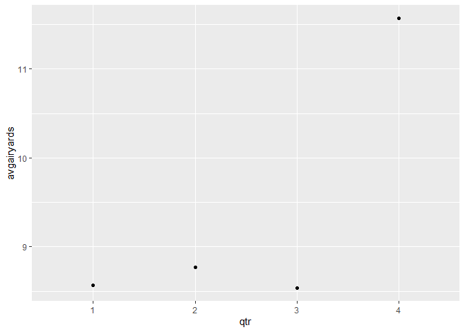<!-- -->

``` r
ggplot(wilson, aes(x=game_seconds_remaining, y=epa)) +
  geom_point() + 
  geom_smooth(method=lm, aes(fill=qtr))+scale_y_continuous(limits = c(-2, 2))
```

    ## Warning: Removed 75 rows containing non-finite values (stat_smooth).

    ## Warning: Removed 75 rows containing missing values (geom_point).

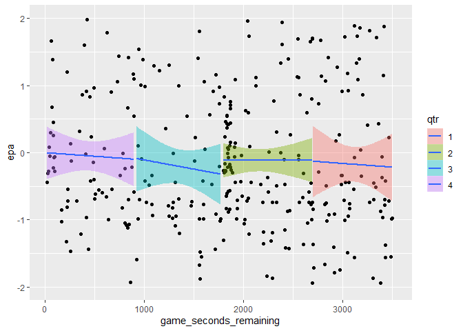<!-- -->

## Pass Location

Looking at the location of pass attempts, as Wilson threw further down
the field, his expected points per play increase. It as noticable that
the Seahawks did not have success with passes behind the line of
scrimmage, which are mostly screen plays, during the season.

``` r
ggplot(wilson, aes(x=air_yards, y=epa))+ geom_jitter(alpha=0.7)+ geom_smooth()
```

    ## `geom_smooth()` using method = 'loess' and formula 'y ~ x'

    ## Warning: Removed 42 rows containing non-finite values (stat_smooth).

    ## Warning: Removed 42 rows containing missing values (geom_point).

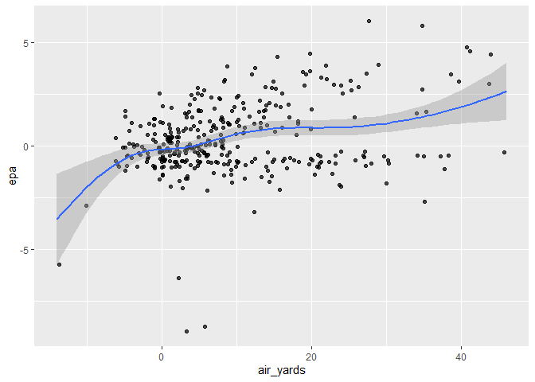<!-- -->

Wilson was far more effective throwing to the middle of the field, while
being throwing to the left and right side of the field with about equal
effectiveness. However, he throws to the middle of the field the least
amount. This high epa does not appear to be from throwing the ball deep
down the field as a majority of Wilson’s attempts were between -5 and 10
yards when throwing to the middle of the field.

``` r
wilsonpasslocationEPAsavg <- wilson %>%
  group_by(pass_location) %>%
  filter(!is.na(pass_location)) %>%
  summarize(AvgEpa=mean(epa))

passlocat <- wilson %>%
  group_by(pass_location) %>%
  filter(!is.na(pass_location))

ggplot(wilsonpasslocationEPAsavg, aes(x=pass_location, y=AvgEpa))+ geom_point()+geom_text(aes(label=AvgEpa),hjust=0.1, vjust=-0.5)+scale_y_continuous(limits = c(0, 1))
```

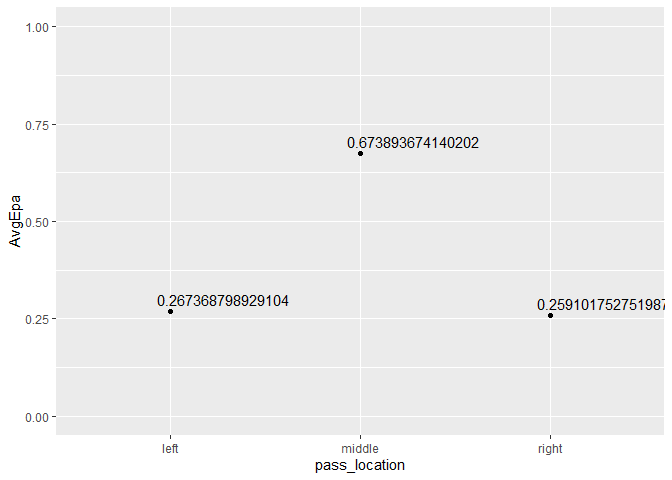<!-- -->

``` r
ggplot(passlocat, aes(x=pass_location))+geom_bar(aes(fill=airyardgroup))
```

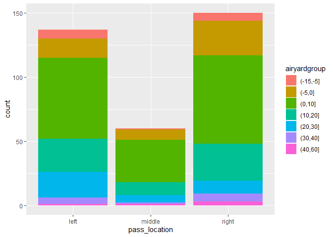<!-- -->

## Completion Percentage

This code calculates the completion percentage for each air yard groups.

``` r
completetionpercent1 <- wilson %>%
  filter(airyardgroup =="(-15,-5]") %>%
  mutate(completionpct = sum(complete_pass)/nrow(.))

completetionpercent2 <- wilson %>%
  filter(airyardgroup =="(-5,0]") %>%
  mutate(completionpct = sum(complete_pass)/nrow(.))

completetionpercent3 <- wilson %>%
  filter(airyardgroup =="(0,10]") %>%
  mutate(completionpct = sum(complete_pass)/nrow(.))

completetionpercent4 <- wilson %>%
  filter(airyardgroup =="(10,20]") %>%
  mutate(completionpct = sum(complete_pass)/nrow(.))

completetionpercent5 <- wilson %>%
  filter(airyardgroup =="(20,30]") %>%
  mutate(completionpct = sum(complete_pass)/nrow(.))

completetionpercent6 <- wilson %>%
  filter(airyardgroup =="(30,40]") %>%
  mutate(completionpct = sum(complete_pass)/nrow(.))

completetionpercent7 <- wilson %>%
  filter(airyardgroup =="(40,60]") %>%
  mutate(completionpct = sum(complete_pass)/nrow(.))


allcompletionperct <- rbind(completetionpercent1, completetionpercent2, completetionpercent3, completetionpercent4, completetionpercent5, completetionpercent6, completetionpercent7)

allcompletionperctshow <- allcompletionperct %>%
  distinct(airyardgroup, completionpct)

allcompletionperctshow
```

    ## # A tibble: 7 x 2
    ##   airyardgroup completionpct
    ##   <fct>                <dbl>
    ## 1 (-15,-5]             0.857
    ## 2 (-5,0]               0.736
    ## 3 (0,10]               0.715
    ## 4 (10,20]              0.6  
    ## 5 (20,30]              0.361
    ## 6 (30,40]              0.5  
    ## 7 (40,60]              0.8

I filtered out sacks and spikes to remove na values in the geom\_bar.

The -15, -5 group has a low epa average and low sum epa but a high
completion percentage, this makes sense because passes completed that
far behind the line of scrimmage are usually done when something goes
wrong and a desperate pass is needed to anyone that’s open. The 0-10
group has by far the most passes but a sum epa similar to the other
higher groups that had many less targets except the 10-20 group. Wilson
only had a 36% completion rate in the 20-30 group but that group still
had a higher sum epa than 0-10 group despite having a 72% completion
rate. Which shows how much more effective a higher depth of target is.
It’s also interesting that the -5, 0 had a slightly lower average epa
and a slightly higher completion percentage than the 0, 10 group, but 0,
10 had many more targets. This shows that the -5, 0 group could be an
area to pass more in instead of 0, 10 because throwing shorter is
usually safer and there is little passing efficiency lost. Wilson also
completed an extremely high 80% of his targets in the 40-60 group and
50% of his targets in the 30-40 group. These two groups had very little
targets but were a large chunk of the total epa earned from passing this
season.

``` r
wilsonairyardnosackspike <- wilson %>%
  filter(sack == 0 & qb_spike==0) 

ggplot(wilsonairyardnosackspike, aes(x=airyardgroup))+geom_bar() + labs(x="Air Yard Group")
```

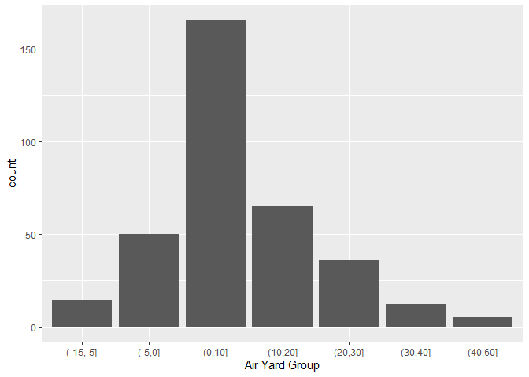<!-- -->

``` r
compsum <- allcompletionperct %>% 
  group_by(airyardgroup, completionpct) %>%
  summarize(epasum = sum(epa))

ggplot(compsum, aes(x=airyardgroup, y=epasum, col=completionpct))+geom_point() + geom_text(aes(label=round(completionpct, 2)),hjust=0.1, vjust=-0.5) + labs(y="Sum EPA", x="Air Yard Group")
```

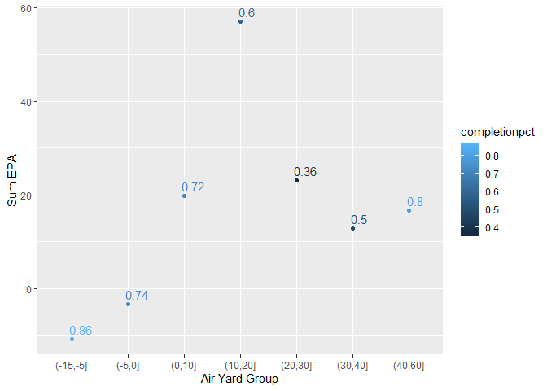<!-- -->

``` r
compavg <- allcompletionperct %>% 
  group_by(airyardgroup, completionpct) %>%
  summarize(epaavg = mean(epa))

ggplot(compavg, aes(x=airyardgroup, y=epaavg, col=completionpct))+geom_point() + geom_text(aes(label=round(completionpct, 2)),hjust=0.1, vjust=-0.5) + labs(y="Average EPA", x="Air Yard Group")
```

<!-- -->

## Yard Line Location

Looking at only touchdown passes, there seems to be a couple of good
spots for Wilson, between goal and 8 yardline, 10 amd 22 yardline, and
the 45 and 55 yardline. As plays happen that are closer to the goal
their average epa steadily increases.

``` r
tdloc <- wilson %>%
  filter(pass_touchdown=="1")

ggplot(tdloc, aes(x=yardline_100))+geom_density(adjust =0.2, aes(fill=pass_touchdown))
```

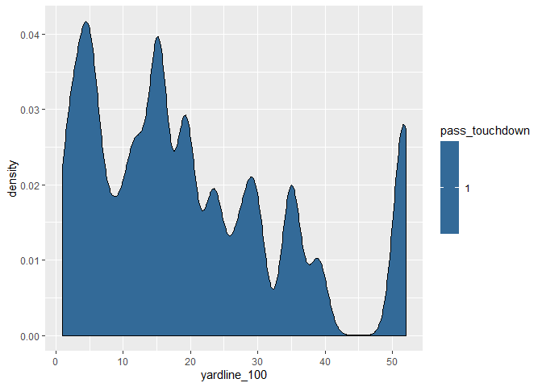<!-- -->

``` r
yardlineepa <- wilson %>%
  group_by(yardlinegroup) %>%
  summarize(avgepa = mean(epa))

ggplot(yardlineepa, aes(x=yardlinegroup, y=avgepa))+geom_point() + labs(y="Average Epa", x="Yard Line Group")
```

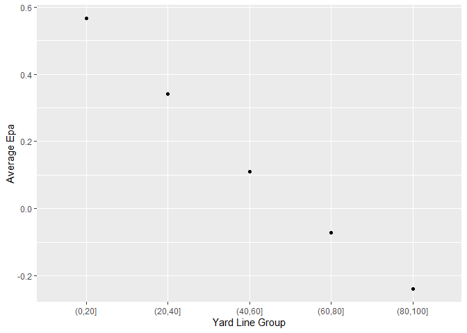<!-- -->

## Downs

I removed fourth down here because it had a small sample size of only 3.
On downs, Wilson threw slightly farther on first down than second down.
This is likely because on first down you can take a risk since you still
have two downs if the throw is unsuccesful. On second down, you have
less margin for air and usally want to take a safer throw. On third down
however, there is a large jump of a couple yards, which shows that
Wilson was willing to take risks on third down. The average epa went up
on each down, the highest epa on third down is likely due to his much
increased average air yards on that down. The increase from first to
second down isn’t as clear, I suspect it may be from it being easier to
get a first down pass from the yards gained on the previous down.

``` r
wilsonpasslengthsdown <- wilson %>%
  group_by(down) %>%
  filter(sack == 0 & qb_spike==0 & down != 4) %>%
  summarize(avgairyards=mean(air_yards), avgyardstogo=mean(ydstogo))

ggplot(wilsonpasslengthsdown, aes(x=down, group=2))+ geom_line(aes(y = avgairyards, colour = "green")) +geom_line(aes(y = avgyardstogo, colour = "blue"))+ labs(y="Yards", x="Down") + scale_color_manual(name = "Legend", labels = c("Average Yards to go", "Average Air Yards"), values = c("green", "blue")) 
```

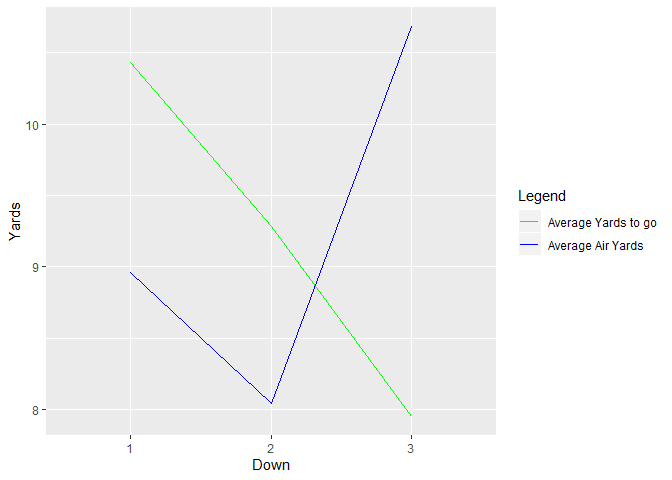<!-- -->

``` r
wilsonpassepadown <- wilson %>%
  group_by(down) %>%
  filter(sack == 0 & qb_spike==0 & down != 4) %>%
  summarize(avgepa=mean(epa))

ggplot(wilsonpassepadown, aes(x=down, y=avgepa)) + geom_point() + labs(y="Average Epa", x="Down")
```

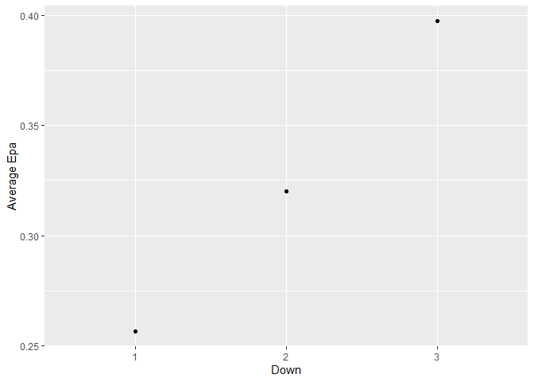<!-- -->

## Wide Receivers

Now to look at wide receivers on the Seahawks. The recievers with the
most targets were Tyler Lockett and Doug Baldwin. Which were also the
first and third highest average epa. Jaron Brown had the least targets
for someone that played in all the games this season but the second
highest average epa. Tyler Lockett was by far the most effective
reciever, with the most targets and averaged 1.2 epa per target. It also
appears that the running backs were among the least effective when used
as recievers.

``` r
wilsonwrtargets <- wilson %>% 
  group_by(receiver_player_name) %>%
  filter(!is.na(receiver_player_name) & n()>10) 

wilsonwrepa <- wilson %>% 
  group_by(receiver_player_name) %>%
  filter(!is.na(receiver_player_name) & n()>10) %>% #filters out sacks
  summarize(AvgEpa=mean(epa))

ggplot(wilsonwrtargets, aes(x=receiver_player_name))+ geom_bar(aes(fill=pass_location))+ xlab("Wide Receiver Name") + ylab("Number of Targets")
```

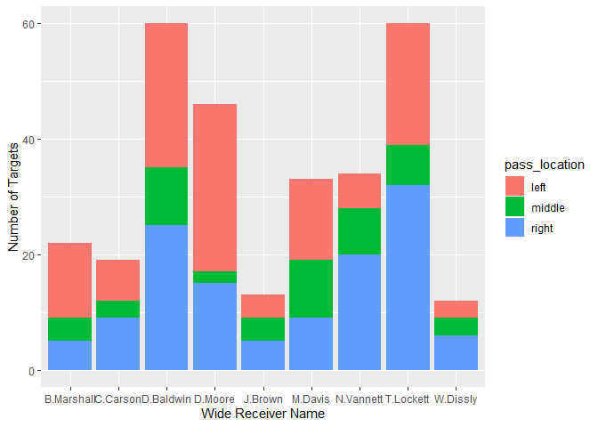<!-- -->

``` r
ggplot(wilsonwrepa, aes(x=receiver_player_name, y=AvgEpa))+ geom_point() + labs(y="Average Epa", x="Wide Receiver Name")
```

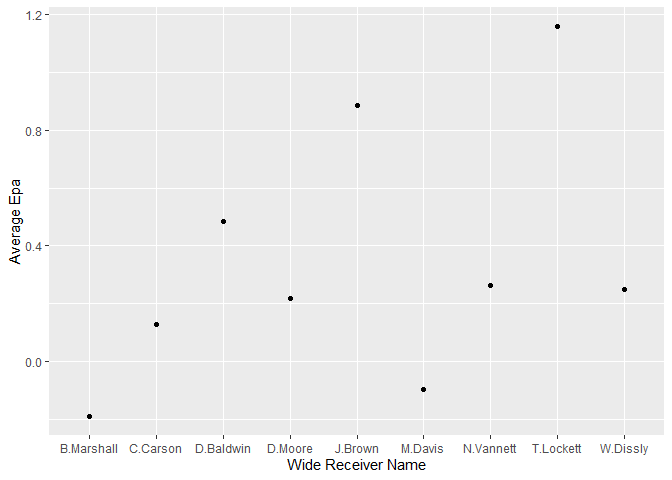<!-- -->

## Wide Receivers and Time

For these plots I filtered to include only receivers with at least 30
targets to make the visual more clear and accurate. We see that most
recievers did not have much of a change to there depth of target except
for tyler Lockett and Nick Vannett. Tyler Lockett’s depth of target rose
steadily as the games got closer to ending. While Nick Vannett’s depth
of target dropped as the game got closer to ending. Looking at epa,
Lockett again proves to be the most effective as the game gets on. Also
intereasting that David Moore epa increased heavily as the game went on
despite starting in negative epa.

``` r
wilsonhighertarget <- wilson %>% 
  group_by(receiver_player_name) %>%
  filter(!is.na(receiver_player_name) & n()>30)

ggplot(wilsonhighertarget, aes(x=game_seconds_remaining, y=air_yards, col=receiver_player_name)) +
  geom_point() + 
  geom_smooth(method=lm, aes(fill=receiver_player_name), se=F)
```

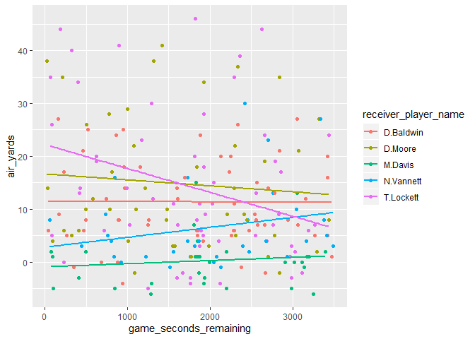<!-- -->

``` r
ggplot(wilsonhighertarget, aes(x=game_seconds_remaining, y=epa, col=receiver_player_name)) + geom_point() + geom_smooth(method=lm, aes(fill=receiver_player_name), se=F)+scale_y_continuous(limits = c(-2, 2))
```

    ## Warning: Removed 45 rows containing non-finite values (stat_smooth).

    ## Warning: Removed 45 rows containing missing values (geom_point).

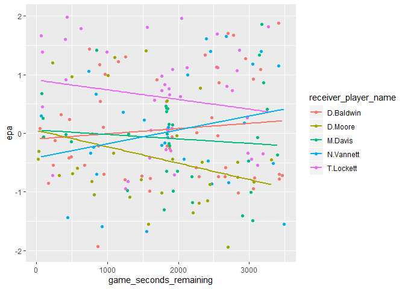<!-- -->

## Model

Here I took most of the variables I’ve been investigating and put them
in a linear regression model to see their significance. For the data set
I removed na values in pass location and receiver player name to allow
me to bind it with the prediction later because the lm function
automatically removed those variable when making the model.

It appears that receiver player name, pass location, and game time were
not that significant in determining epa. However yard line position, air
yards, and completed pass were very significant. Only third down was
significant in determining epa.

``` r
wilsontest <- wilson %>%
  filter(!is.na(pass_location) & !is.na(receiver_player_name))
mod2 <-lm(epa~game_seconds_remaining+yardline_100+air_yards+receiver_player_name+pass_location+complete_pass+down, data=wilson)
summary(mod2)
```

    ## 
    ## Call:
    ## lm(formula = epa ~ game_seconds_remaining + yardline_100 + air_yards + 
    ##     receiver_player_name + pass_location + complete_pass + down, 
    ##     data = wilson)
    ## 
    ## Residuals:
    ##     Min      1Q  Median      3Q     Max 
    ## -6.5188 -0.5927  0.0065  0.5838  3.2507 
    ## 
    ## Coefficients:
    ##                                 Estimate Std. Error t value Pr(>|t|)    
    ## (Intercept)                   -2.114e+00  3.904e-01  -5.415 1.25e-07 ***
    ## game_seconds_remaining         6.372e-05  7.075e-05   0.901  0.36848    
    ## yardline_100                  -8.693e-03  2.960e-03  -2.936  0.00357 ** 
    ## air_yards                      7.270e-02  7.156e-03  10.160  < 2e-16 ***
    ## receiver_player_nameC.Carson   2.553e-01  3.812e-01   0.670  0.50365    
    ## receiver_player_nameD.Baldwin  8.392e-02  2.965e-01   0.283  0.77733    
    ## receiver_player_nameD.Daniels  1.913e-01  1.206e+00   0.159  0.87408    
    ## receiver_player_nameD.Moore    9.432e-03  3.053e-01   0.031  0.97537    
    ## receiver_player_nameE.Dickson  3.591e-01  4.639e-01   0.774  0.43940    
    ## receiver_player_nameG.Fant     1.085e+00  1.199e+00   0.905  0.36621    
    ## receiver_player_nameJ.Brown    2.797e-01  4.109e-01   0.681  0.49666    
    ## receiver_player_nameM.Davis   -9.495e-02  3.339e-01  -0.284  0.77633    
    ## receiver_player_nameM.Turner   9.953e-01  8.632e-01   1.153  0.24979    
    ## receiver_player_nameN.Vannett  2.333e-01  3.255e-01   0.717  0.47410    
    ## receiver_player_nameR.Penny   -3.825e-01  4.579e-01  -0.835  0.40422    
    ## receiver_player_nameR.Wilson  -2.605e+00  1.210e+00  -2.153  0.03213 *  
    ## receiver_player_nameT.Lockett  1.742e-01  3.015e-01   0.578  0.56386    
    ## receiver_player_nameT.Madden   1.091e+00  7.306e-01   1.493  0.13658    
    ## receiver_player_nameT.Swoopes  1.467e+00  1.201e+00   1.221  0.22303    
    ## receiver_player_nameW.Dissly   5.011e-01  4.262e-01   1.176  0.24060    
    ## pass_locationmiddle            1.451e-01  1.936e-01   0.749  0.45423    
    ## pass_locationright            -1.608e-02  1.493e-01  -0.108  0.91435    
    ## complete_pass                  2.656e+00  1.553e-01  17.099  < 2e-16 ***
    ## down2                          1.436e-01  1.642e-01   0.875  0.38240    
    ## down3                          3.884e-01  1.712e-01   2.268  0.02401 *  
    ## down4                          4.987e-01  8.485e-01   0.588  0.55712    
    ## ---
    ## Signif. codes:  0 '***' 0.001 '**' 0.01 '*' 0.05 '.' 0.1 ' ' 1
    ## 
    ## Residual standard error: 1.158 on 302 degrees of freedom
    ##   (64 observations deleted due to missingness)
    ## Multiple R-squared:  0.5893, Adjusted R-squared:  0.5553 
    ## F-statistic: 17.33 on 25 and 302 DF,  p-value: < 2.2e-16

``` r
pred <-predict(mod2)
modelresult <- cbind(wilsontest, pred)
modelresult <- modelresult %>%
  mutate(res = epa - pred) %>%
  select(epa, pred, res)

head(modelresult)
```

    ##          epa       pred        res
    ## 1 -0.8732052 -0.5979378 -0.2752673
    ## 2  2.4400943  1.8465116  0.5935827
    ## 3 -2.0138411 -1.6733902 -0.3404509
    ## 4  4.3091475  1.8340845  2.4750630
    ## 5 -0.7384247 -1.2850897  0.5466650
    ## 6 -1.0530692 -1.2688625  0.2157933

## Summary

The best conditions for Wilson to pass are to be at the end of the game,
on third down, targeting the middle of the field, with a depth of target
of at least 30 yards.

Tyler Lockett was clearly the most effective wide receiver for the
season, with Doug Baldwin being the second best. While Jaron Brown had
the second highest average epa, he had very few targets which makes his
case for second best not as strong as Baldwin’s as Baldwin had a much
higher number of targets.

I think I was able to accomplish a good investigation of the passing
game during the 2018 season using a variety of graphing and data
manipulation skills. I was able to look at a variety of focused areas
that make up the passing game and find the best conditions of each. I
would like to investigate more in yard line position, completion
percentages, and air yards because they were what I discovered to be the
most significant variables.
